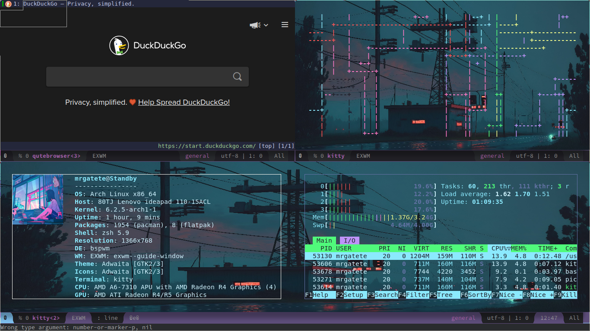

# Gallery





## Dependencies

```
rofi kitty qutebrowser usuim emacs emacs-exwm (or M-x package-install RET exwm RET) spacemacs
```

### Install

in emacs.d is the config you can use for shortcuts and functions, remember to put it at the end of your file.

**Install spacemacs**

```bash
git clone https://github.com/syl20bnr/spacemacs ~/.emacs.d
```
**Install dots**

```bash
git clone https://github.com/Sstandby/dotfiles
cd dotfiles
cp -r ./config/* ~/.config/
```
